# Introducing Linux and Unix
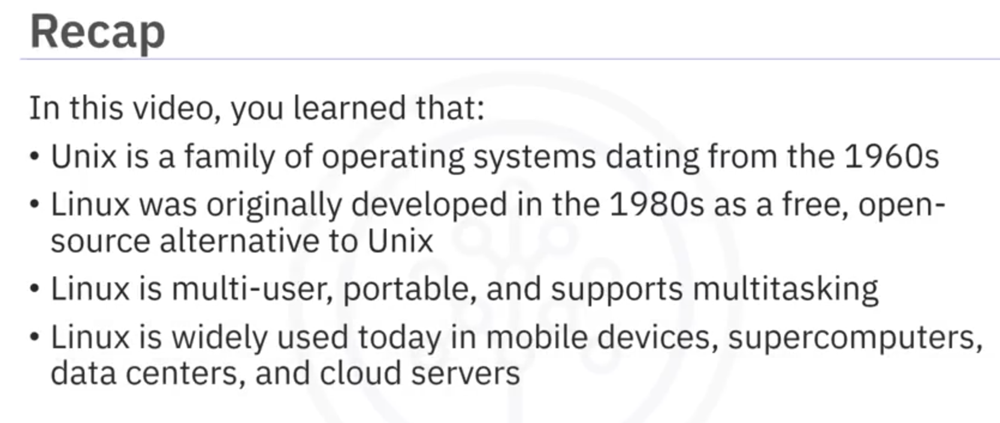

# Linux Distributions
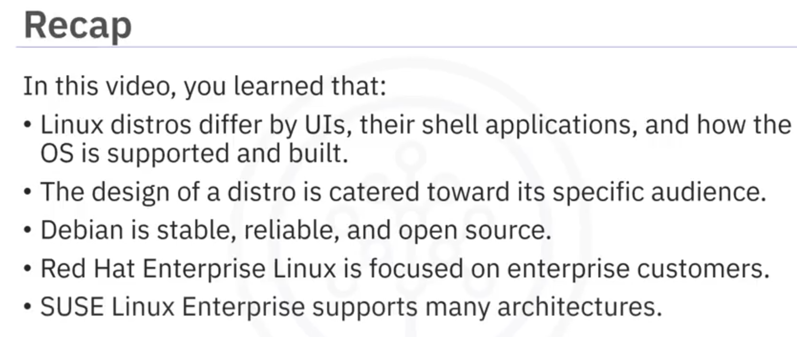

# Overview of Linux Architecture
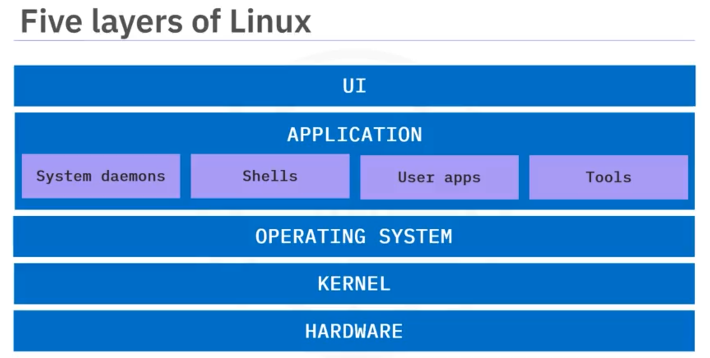
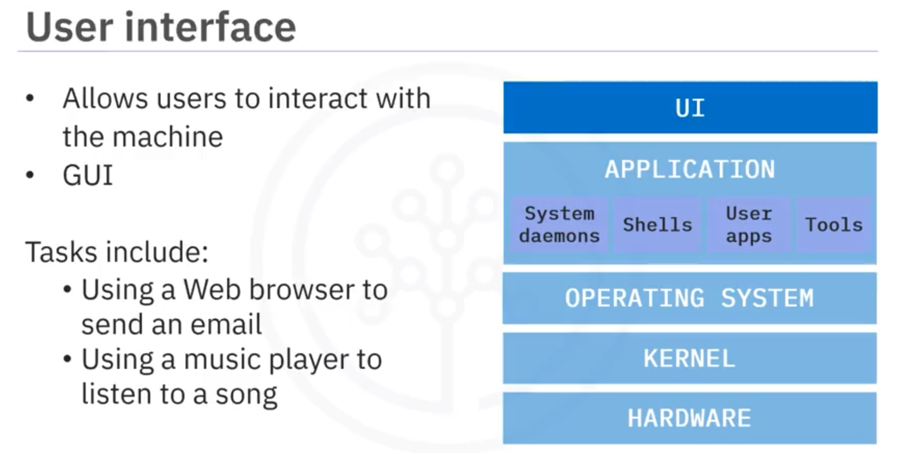
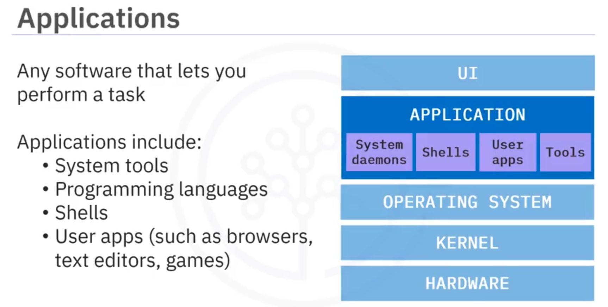
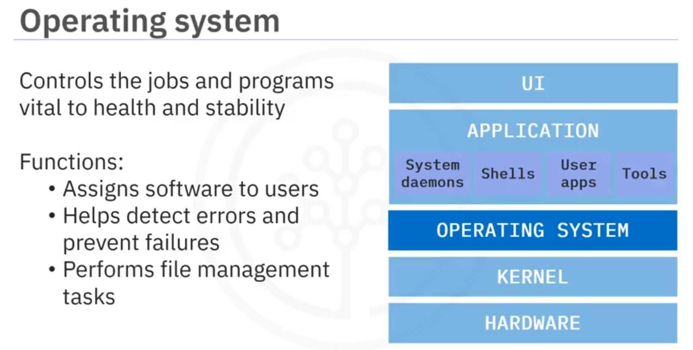
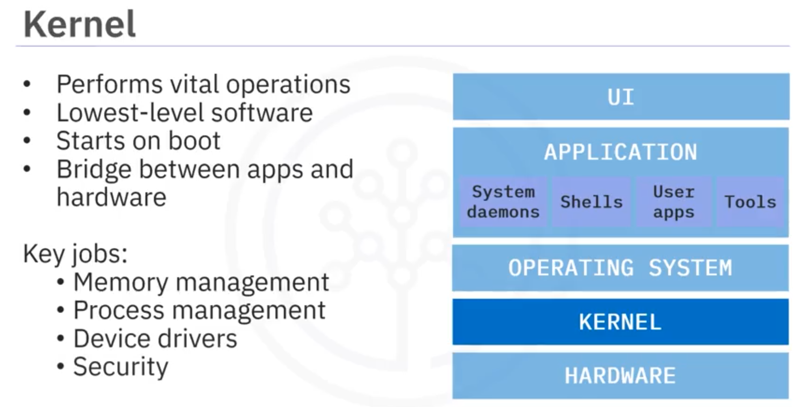
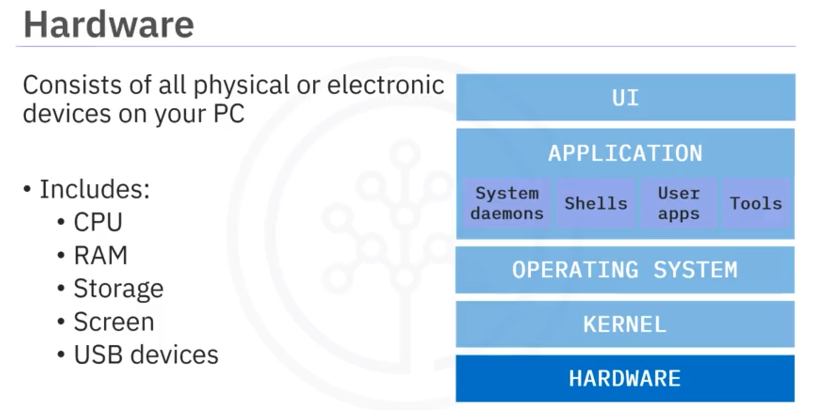
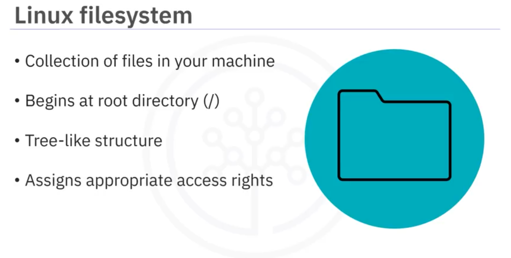
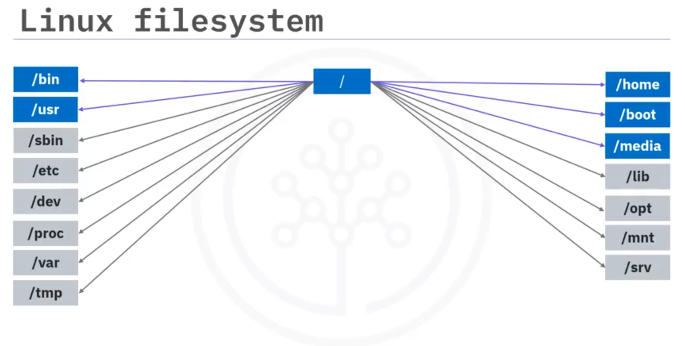
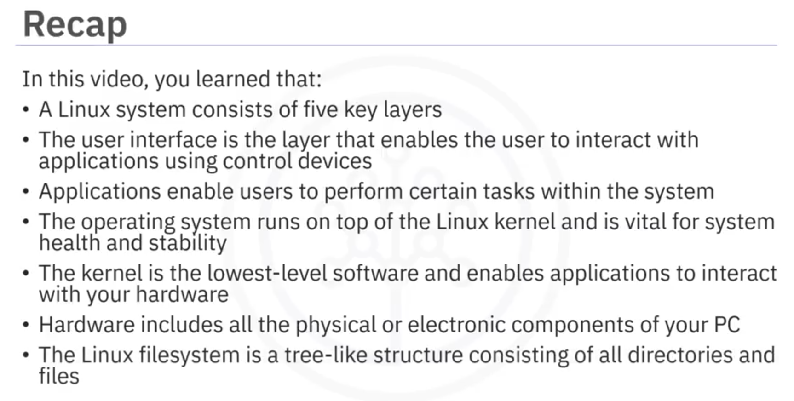

# Linux Terminal Overview

## Linux Shell
- The Linux shell is an OS-level application that interprets commands.
- In early Unix and Linux, the shell was the only way to interact with the OS.
- While GUI is available, the shell remains a popular choice for flexibility and scripting.
- Shell commands help with tasks like moving files, reading/writing data, and searching.
- Common shell versions:
  - **Bash**
  - **Zsh**

## Linux Terminal
- The terminal is an application or user interface for entering commands.
- It relays commands to the shell, which executes them via the OS kernel.
- Example: Running a Python program:
  ```sh
  python myprogram.py
  ```
- The process:
  - User enters a command in the terminal.
  - Terminal sends it to the shell.
  - The shell interacts with the OS kernel.
  - Kernel processes the command and returns the result to the terminal.

## Terminal Navigation
- **Command Line**: Area where commands are entered.
- **Command Prompt**: Cursor indicating where text will be displayed.
- **Current Working Directory (CWD)**: Directory where commands are executed.
- **Path Structure**: Hierarchical representation of files/directories.
  - `/` (Root directory)
  - `~` (User home directory)
  - `..` (Parent directory)
  - `.` (Current directory)

### Using `cd` (Change Directory)
- Navigate to the root directory:
  ```sh
  cd /
  ```
- Move to the bin directory inside root:
  ```sh
  cd bin
  ```
- Navigate to home directory:
  ```sh
  cd ~
  ```
- Move up one level:
  ```sh
  cd ..
  ```
- Move up two levels:
  ```sh
  cd ../..
  ```
- Navigate to a specific directory:
  ```sh
  cd /home/me/Documents
  ```

## Running Commands
- Run an executable file in the current directory:
  ```sh
  ./ls
  ```
- Run `ls` from anywhere (if built into the shell):
  ```sh
  ls
  ```

## Summary
- The **Linux shell** is an OS-level application for executing commands.
- A **terminal** allows users to interact with the shell.
- The **cd** command is used to navigate the Linux filesystem.

Here’s a concise summary of the content in Markdown format:

<br/>

# Creating and Editing Text Files in Linux

## Types of Text Editors
1. **Command-Line Text Editors**:
   - **GNU nano**: Small, user-friendly, modeless editor.
   - **vi**: Traditional Unix editor.
   - **vim**: Powerful, mode-based editor based on vi.
2. **GUI-Based Text Editors**:
   - **gedit**: Default GNOME editor, simple and modern.
   - **emacs**: Versatile editor, usable in GUI or command-line mode.

## Key Features
### gedit (GUI-Based)
- Integrated file browser.
- Undo/redo, search/replace (with regex support).
- Syntax highlighting.
- Extensible via plugins.

### GNU nano (Command-Line)
- Undo/redo, search/replace (with regex support).
- Syntax highlighting, auto-indentation, line numbering.
- Multiple buffers for editing multiple files.
- **Usage**: `nano <filename>` to open/edit a file.
- **Navigation**: Arrow keys, Page Up/Down, Home/End.
- **Commands**: Ctrl + key (e.g., Ctrl + G for help, Ctrl + W to search).

### vim (Command-Line)
- **Modes**:
  - **Insert Mode**: Enter text (press `i` to start).
  - **Command Mode**: Navigate, save, etc. (press Esc to switch).
- **Basic Commands**:
  - Save: `:w` (write) or `:w <filename>` (save as).
  - Quit: `:q` (exit), `:q!` (quit without saving).
- Requires practice to master but highly efficient.

Here’s a concise summary of the content in Markdown format:

<br/>

# Installing Software and Updates in Linux

## Packages and Package Managers
- **Packages**: Archive files containing software or updates for Linux.
- **Package Managers**: Tools to download and install packages (GUI or command-line).

## Package Types
1. **.deb Files**:
   - Used by Debian-based distros (e.g., Debian, Ubuntu, Mint).
   - "Deb" = Debian.
2. **.rpm Files**:
   - Used by Red Hat-based distros (e.g., CentOS/RHEL, Fedora, openSUSE).
   - "RPM" = Red Hat Package Manager.
- **Conversion**: Use the `alien` tool to convert between formats:
  - RPM to `.deb`: `alien <package_name>`
  - `.deb` to RPM: `alien -r <package_name>`

## Benefits of Package Managers
- Resolve dependencies automatically.
- Notify about available updates.
- GUI tools check for updates regularly.
- Allow selective or automatic update installation.

## GUI-Based Package Managers
1. **Update Manager** (`.deb`-based):
   - Checks daily for updates, auto-installs security updates.
   - Displays other updates weekly.
   - Manual check: Select updates → "Install Updates" → Enter password.
2. **PackageKit** (`.rpm`-based):
   - Shows a starburst icon when updates are available.
   - Configurable update checks.
   - Manual check: Select updates → "Install Updates" → Enter password.

## Command-Line Package Managers
1. **apt** (`.deb`-based):
   - Update package list: `sudo apt update`
   - Upgrade all packages: `sudo apt upgrade`
   - Install specific package: `sudo apt install <package_name>`
2. **yum** (`.rpm`-based):
   - Update all packages: `sudo yum update` (fetches, summarizes, confirms, installs).
   - Install specific package: `sudo yum install <package_name>`

## Installing Software
- **apt**: `sudo apt install <package_name>` (`.deb`-based).
- **yum**: `sudo yum install <package_name>` (`.rpm`-based).
- **pip** (Python example): `pip install pandas` (searches, downloads, resolves dependencies, installs).

## Conclusion
- `.deb` and `.rpm` are key package types for Debian- and Red Hat-based distros, convertible with `alien`.
- **GUI Tools**: Update Manager (`.deb`), PackageKit (`.rpm`).
- **Command-Line Tools**: `apt` (`.deb`), `yum` (`.rpm`).
- Package managers simplify software installation and updates.
